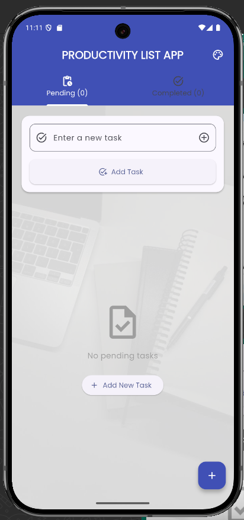
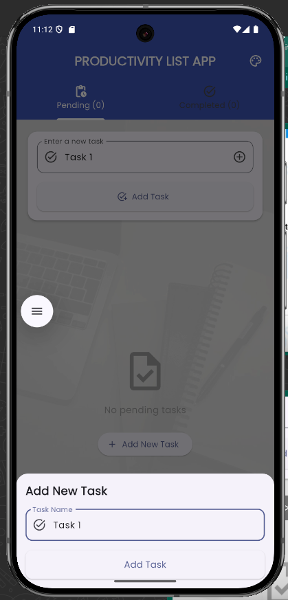
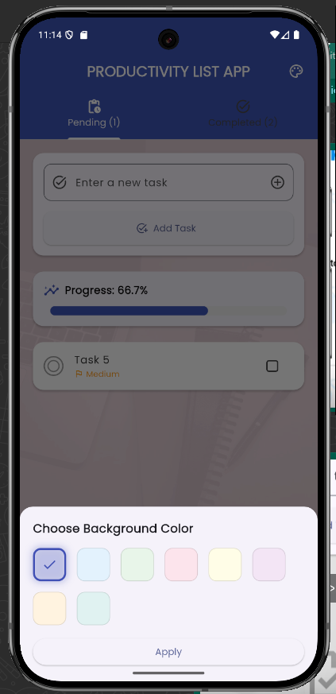

# 📝 Productivity App - Flutter

A simple and beautifully designed productivity application built using **Flutter**, designed to help users manage daily tasks efficiently.

## ✨ Features

- ✅ Add, display, and manage your daily tasks
- 📋 Todo list with checkbox for task completion
- 📊 Live task completion percentage calculation
- 🖌️ Customizable background color
- 🎨 Choose from 6+ color options
- 🧼 Swipe to delete with confirmation dialog
- 🖼️ Background image support (customizable)
- 🌈 Clean UI using **Poppins** font & Material Icons

## 📸 Screenshots

| Home Screen | Task Added | Color Picker |
|-------------|-------------|--------------|
|  |  |  |

## 🚀 Getting Started

### 1. Clone the repo

```bash
git clone https://github.com/your-username/productivity_app.git
cd productivity_app
